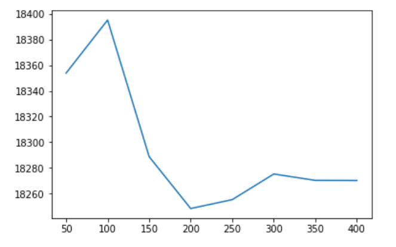

# Overview

I joined [this 30-day challenge](https://www.kaggle.com/thirty-days-of-ml) to have a nice daily refresher of basic ML concepts,
and to finally join the Kaggle community. Looking forward to sharing 
my experience.

| Course      | Certificate |
| ----------- | ----------- |
| [Python](https://www.kaggle.com/learn/python)         |         |
| [Intro to ML](https://www.kaggle.com/learn/intro-to-machine-learning)         |    |
| [Intermediate ML](https://www.kaggle.com/learn/intermediate-machine-learning)         |   |


# Python


## Day 1 - 08/02/2021: Level up to Contributor

Today's challenge was very simple. It consisted of using a dummy 
notebook and adding some code snippets to build a simple Random Forest
classifier model to predict whether an individual would survive the titanic
based on simple features. This is the quintessential Kaggle example
that everyone refers to. Interestingly enough, women
survived at a rate of 74%, whereas men only survived at a rate of 19%. 
It does beg the question, why the disparity? 

As part of the daily challenge, I submitted the predictions from the Random
Forest classifier, posted a comment, and gave an upvote to another 
individual's post. The objective was to raise my ranking from Novice 
to Contributor status. Overall, the initial challenge was pretty easy.


## Day 2 - 08/03/2021: Hello, Python

Today's challenge was very easy. 
It was basic arithmetic operators and order of operations in python.
I like the simplicity of it. 
I could see being able to understand it easily even if I was not fluent in python.
It was nice how it covered little tricks like the in-place swapping `b, a = a, b`.

## Day 3 - 08/04/2021: Functions and Getting Help

Another simple challenge. The idea of this
exercise was to learn the anatomy of a function and
how to use `help()` to learn more. 

I did learn that  `round()` can round to a negative number of decimal places (i.e. integer place).
What that means essentially is for each value that is negative we round to the `10*n`th place.
So if the value is `-1`, we round to the tens place. If it is -3, we round to the thousands place.

```python
# Will yield 0 because 10 rounded to the hundreds is 0.
round(10, -2)
```

## Day 4 - 08/05/2021: Booleans and Conditionals 

This challenge got a little more interesting. 
They structured the examples for conditional evaluation as word problems and
ask you to identify the errors based on the scenario you are trying to solve.
For example there are a set of 4 conditionals associated with if you should take an umbrella,
but given the order of operations and lack of parentheses it evaluates incorrectly.

The concepts that were introduced were simple. There was a few examples where I solved things in a different fashion:

```python
def sign(num):
    """
    This function returns 1 if positive, -1 if negative and 0 if 0
    """
    if num == 0:
        return num
    return num / abs(num)
```

vs. the solution:

```python
def sign(x):
    if x > 0:
        return 1
    elif x < 0:
        return -1
    else:
        return 0
```

...and an interesting blackjack simulator to determine if you as a player should hit. The objective is to beat the dealer in 50000 simulated games.
I chose to experimentally derive rules instead of research well-formed strategy online. I marginally improved over the basic strategy of never hitting.
Surprisingly you can win ~38% of your games if you never hit. My simplistic strategy improves upon it by a little over 3.5%.


I think given more time I would explore more strategies to improve probabilities given the number of aces.
Interestingly you don't get to have any knowledge of the dealer's showing cards to inform your strategy.

Overall this was an enjoyable lesson.

## Day 5 - 08/06/2021: 

### Lists and Tuples

I have begun to really enjoy their liberal use of the help function 
while explaining simple concepts.  I think in some ways this really 
cuts the corner on googling for docs and trying to make sure you are 
seeing the right version. That said using an IDE to drill into the respective 
function is usually my goto. I tend to use PyCharm's Community edition since
it is free and super easy to customize. 
I actually use it to work on this website!
That said, I could see being in a situation where not having a GUI at your
disposal is your day-to-day work, and for that it would be indispensable.

An interesting learning for me was that I learned about the `bit_length()` 
function. I could see this as being useful it you are trying to profile
your memory footprint programmatically, at various points throughout 
execution of a program:

```python
Help on built-in function bit_length:

bit_length() method of builtins.int instance
    Number of bits necessary to represent self in binary.
    
    >>> bin(37)
    '0b100101'
    >>> (37).bit_length()
    6
```

The exercise was actually simpler than the previous day, but it 
presented an interesting question which distilled into its simplest parts is:

> Given a list, determine if your element is in the second half, 
> but is not the final element.

In the example they pose a list of party members in a 
sorted list by arrival time. You need to find out if the guest in question
arrived fashionably late. There are many ways to slice this problem. My
solution looked like this:

```python
def fashionably_late(arrivals, name):
    """Given an ordered list of arrivals to the party and a name, return whether the guest with that
    name was fashionably late.
    """
    name_index = arrivals.index(name)
    return name_index != len(arrivals) -1 and name_index >= (len(arrivals) / 2)
```

### Loops and List Comprehensions

This section was a little interesting. 
I liked the comprehensive nature by which they explained one of the examples.

I like how they consider efficiency. 
For instance, my solution required a pointer whereas theirs used the index 
plus `range()` to keep track of the previous element. I would argue
they are both pretty readable, but in terms of conciseness I prefer their
solution.

My Solution:

```python
def menu_is_boring(meals):
    """Given a list of meals served over some period of time, return True if the
    same meal has ever been served two days in a row, and False otherwise.
    """
    prev_meal = None
    for meal in meals:
        if meal == prev_meal:
            return True
        prev_meal = meal
    return False
```

Their Solution:

```python
def menu_is_boring(meals):
    # Iterate over all indices of the list, except the last one
    for i in range(len(meals)-1):
        if meals[i] == meals[i+1]:
            return True
    return False
```

## Day 6 - 08/07/2021: Strings and Dictionaries

This lesson taught me about dictionary comprehensions. Very cool.
I wish I had know about this before. It actually allowed me to 
do a simple, yet readable one liner solution:

My solution:
```python
def multi_word_search(doc_list, keywords):
    """
    Takes list of documents (each document is a string) and a list of keywords.  
    Returns a dictionary where each key is a keyword, and the value is a list of indices
    (from doc_list) of the documents containing that keyword

    >>> doc_list = ["The Learn Python Challenge Casino.", "They bought a car and a casino", "Casinoville"]
    >>> keywords = ['casino', 'they']
    >>> multi_word_search(doc_list, keywords)
    {'casino': [0, 1], 'they': [1]}
    """
    return {keyword:word_search(doc_list, keyword) for keyword in keywords}
```

Their solution: 
```python
def multi_word_search(documents, keywords):
    keyword_to_indices = {}
    for keyword in keywords:
        keyword_to_indices[keyword] = word_search(documents, keyword)
    return keyword_to_indices
```

Both solutions leverage the function codified in the previous example for this 
day's lesson:
```python
def word_search(doc_list, keyword):
    """
    Takes a list of documents (each document is a string) and a keyword. 
    Returns list of the index values into the original list for all documents 
    containing the keyword.

    Example:
    doc_list = ["The Learn Python Challenge Casino.", "They bought a car", "Casinoville"]
    >>> word_search(doc_list, 'casino')
    >>> [0]
    """
    indices = []
    for i in range(len(doc_list)):
        tokenized_prepped_doc = doc_list[i].lower().translate(doc_list[i].maketrans('', '', ',.')).split()
        if keyword.lower() in tokenized_prepped_doc:
            indices.append(i)
        
    return indices 
```

In this case I actually prefer my solution over the one proposed by the 
course instructor. There is no sacrifice in terms of readability and it
also helps to serve as a reminder that dictionary comprehensions are a powerful
tool to short circuit verbose looping.

## Day 7 - 08/08/2021: Working with External Libraries

Today I was reminded of how useful the `dir()` function is and how useful it
is as a companion function to `help()`. 
I am realizing there is a lot of efficiencies that can be gained by 
re-observing the basics from the lens of a python beginner.

```python
>>> print(dir(math))

['__doc__', '__file__', '__loader__', '__name__', '__package__', '__spec__', 'acos', 'acosh', 'asin', 'asinh', 'atan', 'atan2', 'atanh', 'ceil', 'copysign', 'cos', 'cosh', 'degrees', 'e', 'erf', 'erfc', 'exp', 'expm1', 'fabs', 'factorial', 'floor', 'fmod', 'frexp', 'fsum', 'gamma', 'gcd', 'hypot', 'inf', 'isclose', 'isfinite', 'isinf', 'isnan', 'ldexp', 'lgamma', 'log', 'log10', 'log1p', 'log2', 'modf', 'nan', 'pi', 'pow', 'radians', 'remainder', 'sin', 'sinh', 'sqrt', 'tan', 'tanh', 'tau', 'trunc']
```

The challenges from the exercise were interesting. 
A little challenging, but not too difficult.
The most memorable one was coding a function to determine if the players hand
beats an opponent's hand in blackjack. It was pretty straightforward. Here is 
my solution:

```python
def blackjack_hand_greater_than(hand_1, hand_2):
    """
    Return True if hand_1 beats hand_2, and False otherwise.
    
    In order for hand_1 to beat hand_2 the following must be true:
    - The total of hand_1 must not exceed 21
    - The total of hand_1 must exceed the total of hand_2 OR hand_2's total must exceed 21
    
    Hands are represented as a list of cards. Each card is represented by a string.
    
    When adding up a hand's total, cards with numbers count for that many points. Face
    cards ('J', 'Q', and 'K') are worth 10 points. 'A' can count for 1 or 11.
    
    When determining a hand's total, you should try to count aces in the way that 
    maximizes the hand's total without going over 21. e.g. the total of ['A', 'A', '9'] is 21,
    the total of ['A', 'A', '9', '3'] is 14.
    
    Examples:
    >>> blackjack_hand_greater_than(['K'], ['3', '4'])
    True
    >>> blackjack_hand_greater_than(['K'], ['10'])
    False
    >>> blackjack_hand_greater_than(['K', 'K', '2'], ['3'])
    False
    """
    BLACKJACK = 21
    FACECARDS = 'JQK'
    
    def determine_hand_value(hand):
        """
        Helper function to determine value of hand.
        """
        val = 0
        aces = 0
        for card in hand:
            if card in FACECARDS:
                val += 10
            elif card != 'A':
                val += int(card)
            else:
                aces += 1
                
        # determine if having an ace with value of 11 is valid or not.
        if aces > 0:
            eleven_and_ones = val + 11 + (aces -1) * 1
            if eleven_and_ones <= BLACKJACK:
                val = eleven_and_ones
            else:
                val += aces
        return val
                
                      
    hand1_val = determine_hand_value(hand_1)
    hand2_val = determine_hand_value(hand_2)
    
    # If player has a valid hand and the opponent either busted or has a lower value then the player wins
    if hand1_val <= BLACKJACK and  (hand2_val > BLACKJACK or hand2_val < hand1_val):
        return True
    
    # Player loses
    return False
```

After completing this lesson I earned a 
certificate of completion for the Python course.

# Intro to ML

## Day 8 - 08/09/2021: 

### How Models Work

This section was pretty elementary, but I felt like
the information was conveyed was intentional and thought-provoking.
Starting with decision trees makes a lot of sense given
the human thought process in generating a simple mental
model.

### Basic Data Exploration

Introducing the `describe()` function is a nice touch.
I haven't really seen it used much in the wild, and I 
see it as being a simple EDA first step. 

The exercise was pretty simple. But it had a few nice
examples of how to dissect a simple dataframe to answer
simple questions about housing prices:

```python
home_data_describe_df = home_data.describe()
# What is the average lot size (rounded to nearest integer)?
avg_lot_size = int(round(home_data_describe_df['LotArea']['mean'], 0))
# As of today, how old is the newest home (current year - the date in which it was built)
newest_home_age = 2021 - int(round(home_data_describe_df['YearBuilt']['max'], 0))
```

## Day 9 - 08/10/2021: 

### Your First Machine Learning Model

In this unit I used a DecisionTreeRegressor similar to the 
example laid out in the previous lesson. Interestingly when looking at the 
top 10 records it seems to predict with 100% accuracy the price. For this reason
I suspect the model may be overfitting, but I am not certain. Measuring
the performance on the training set isn't a good indication of final performance.

### Model Validation

This section introduces the concept of the train/test split and 
measuring your models performance not against the training set (in-sample),
but instead against the validation set. Given that the example is a regression
example about house prices, the MAE (mean absolute error) metric is used 
to measure the performance of the model. There is stark difference between
in-sample and out-of-sample performance MAE. The MAE for training is ~$60
versus the MAE for validation is ~$30,000!

```python
from sklearn.metrics import mean_absolute_error
import numpy as np
val_mae = mean_absolute_error(val_predictions, val_y)
train_mae = mean_absolute_error(train_predictions, train_y)
# uncomment following line to see the validation_mae
print("val_mae:", val_mae)
print("train_mae:", train_mae)
print("average_prices_train:", np.mean(train_y))
print("average_prices_val:", np.mean(val_y))

# val_mae: 29652.931506849316
# train_mae: 61.85692541856926
# average_prices_train: 182319.75707762557
# average_prices_val: 176725.51232876713
```

After looking at the average prices we notice that they are not vastly different
from validation to training dataset. This shows that the difference in MAE
is due to a difference in prediction power, not vastly different SalesPrice
values. This is an important part of the validation process.

## Day 10 - 08/11/2021: 

### Underfitting and Overfitting

I was a bit disappointed that the exercise itself 
didn't ask you to characterize the curve to determine 
the dropoff in performance between train and validation. There was an
example in the lesson, but I felt it would have been a critical
example for someone to learn the concept.

I like how they solved the problem of getting the 
min MAE using a dictionary comprehension and taking the min. I 
didn't know you could use the min function this way:

```python
# Here is a short solution with a dict comprehension.
# The lesson gives an example of how to do this with an explicit loop.
scores = {leaf_size: get_mae(leaf_size, train_X, val_X, train_y, val_y) for leaf_size in candidate_max_leaf_nodes}
best_tree_size = min(scores, key=scores.get)
```

This `best_tree_size` was used to create the best candidate model for
our decision tree regressor model.

### Random Forests

I have always liked the idea of ensembling and especially the manner in 
which Random Forest does it. I like the idea of selecting random subsets
of the features with random subsets of the data and instead of creating 
a singular tree, you instead create a forest and ensemble your models
to be robust against overfitting. The difference in MAE was apparents:

`27282.50803885739` for the `DecisionTreeRegressor` vs. 
`21857.15912981083` for the `RandomForestRegressor` without any tuning.

## Day 11 - 08/12/2021: 

This day was fairly simple and revolved around improving your `RandomForestRegressor`
model to reduce your MAE. The exercise itself wasn't difficult, but I think the
real challenge involves how to go through the process of substantially reducing MAE
to reach the top of the leaderboard. Overall very fun.

# Intermediate ML

## Day 12 - 08/13/2021: 

### Missing Values

This section introduces the idea of using missing value imputation.
To improve model performance. You can use mean or median value.
Median makes the most sense to me because it is most robust 
to skewness in the data.

### Categorical Variables

In this section I learned about using ordinal and one-hot encoding.
I am familiar with both, but it was interesting seeing how 
it affected model performance. 

I really hadn't used ordinal encoding before, but it is the
simplest in concept, yet I have seen one-hot encoding used 
a lot more in practice.

By the end of the day following these examples I was able to see my
position in the leaderboard jump from 7000+ to the 3000s and lowered
my MAE to `16625.54251`.

## Day 13 - 08/14/2021: 

### Pipelines

Learning more about `sklearn` pipelines was a bit interesting.
I can see how it would be useful from a reproducability work standpoint.
I could also see how if you were iterating quickly you would opt
for not using a pipeline especiallly for slight tweaks on later
steps in the final pipeline. But I do like how it ensures that
whatever preprocessing you did on `X_train` and `X_validate`
can easily be done on `X_test`.

My final pipeline ended up looking like this:

```python
# Preprocessing for numerical data
numerical_transformer = SimpleImputer(strategy='median')

# Preprocessing for categorical data
categorical_transformer = Pipeline(steps=[
    ('imputer', SimpleImputer(strategy='most_frequent')),
    ('onehot', OneHotEncoder(handle_unknown='ignore', sparse=False))
])

# Bundle preprocessing for numerical and categorical data
preprocessor = ColumnTransformer(
    transformers=[
        ('num', numerical_transformer, numerical_cols),
        ('cat', categorical_transformer, categorical_cols)
    ])

# Define model
model = RandomForestRegressor(n_estimators=100, random_state=0, criterion='mae') # Your code here

# Bundle preprocessing and modeling code in a pipeline
my_pipeline = Pipeline(steps=[('preprocessor', preprocessor),
                              ('model', model)
                             ])

# Preprocessing of training data, fit model 
my_pipeline.fit(X_train, y_train)

# Preprocessing of validation data, get predictions
preds = my_pipeline.predict(X_valid)

# Evaluate the model
score = mean_absolute_error(y_valid, preds)
print('MAE:', score)
```

I actually achieved a slightly worse MAE than before, but
with tweaking of the `RandomForestRegressor` hyperparameters 
I could see it being an improvement.

### Cross-validation

I am pretty familiar with cross-validation from the courses
I have taken in the past. I do like that this less introduced
using plots to visually capture hyperparameter tuning as a 
debugging and iterative process. Prior to this lesson 
there wasn't generally much graphing involved. 

This was the code:

```python
def get_score(n_estimators, cv=3):
    """Return the average MAE over 3 CV folds of random forest model.
    
    Keyword argument:
    n_estimators -- the number of trees in the forest
    """
    # Replace this body with your own code
    my_pipeline = Pipeline(steps=[('preprocessor', SimpleImputer()),
                              ('model', RandomForestRegressor(n_estimators=n_estimators,
                                                              random_state=0))
                             ])
    scores = -1 * cross_val_score(my_pipeline, X, y,
                              cv=cv,
                              scoring='neg_mean_absolute_error')
    
    return scores.mean()

results = {key: get_score(key) for key in range(50, 450, 50)} # Your code here


import matplotlib.pyplot as plt
%matplotlib inline

plt.plot(list(results.keys()), list(results.values()))
plt.show()
```

And this is the plot:



With lowest average MAE found by:

```python
n_estimators_best = min(results, key=results.get)
print(n_estimators_best, results[n_estimators_best])

# 200 18248.345889801505
```