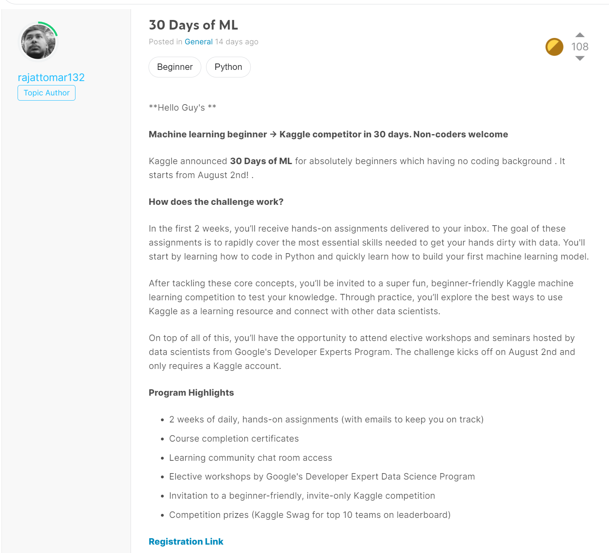

# Overview

I joined [this 30-day challenge](https://www.kaggle.com/thirty-days-of-ml) to have a nice daily refresher of basic ML concepts,
and to finally join the Kaggle community. Looking forward to sharing 
my experience.

# Day 1 - 08/02/2021: Level up to Contributor

Today's challenge was very simple. It consisted of using a dummy 
notebook and adding some code snippets to build a simple Random Forest
classifier model to predict whether an individual would survive the titanic
based on simple features. This is the quintessential Kaggle example
that everyone refers to. Interestingly enough, women
survived at a rate of 74%, whereas men only survived at a rate of 19%. 
It does beg the question, why the disparity? 

As part of the daily challenge, I submitted the predictions from the Random
Forest classifier, posted a comment, and gave an upvote to another 
individual's post. The objective was to raise my ranking from Novice 
to Contributor status. Overall, the initial challenge was pretty easy.

# Day 2 - 08/03/2021: Hello, Python (Python Lesson 1)

Today's challenge was very easy. 
It was basic arithmetic operators and order of operations in python.
I like the simplicity of it. 
I could see being able to understand it easily even if I was not fluent in python.
It was nice how it covered little tricks like the in-place swapping `b, a = a, b`.