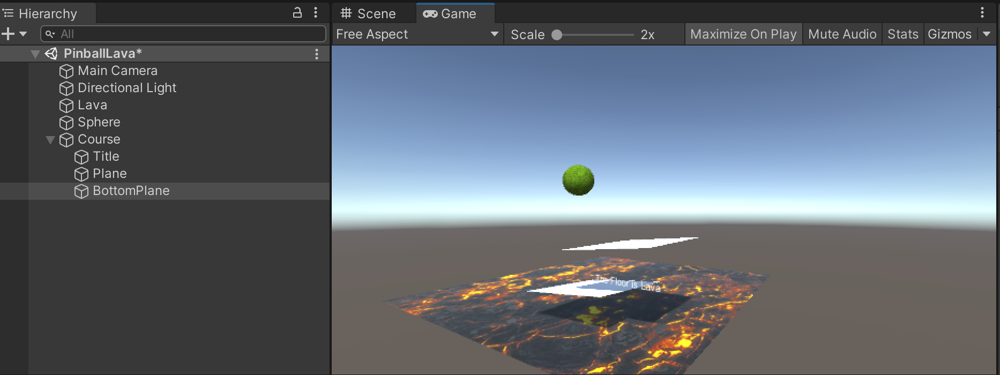
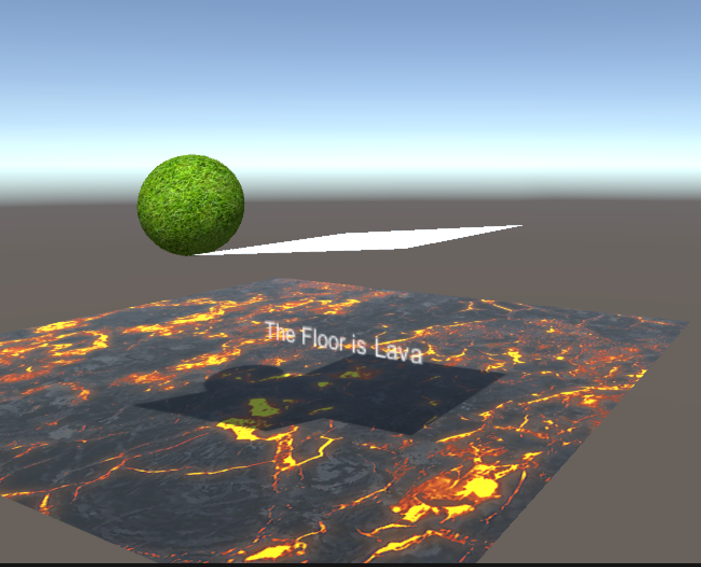
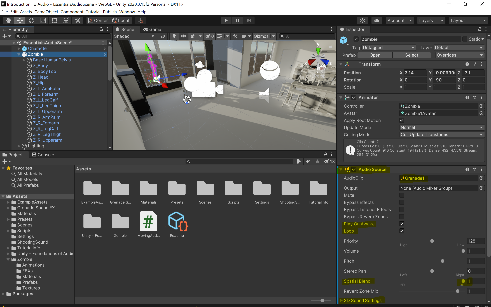
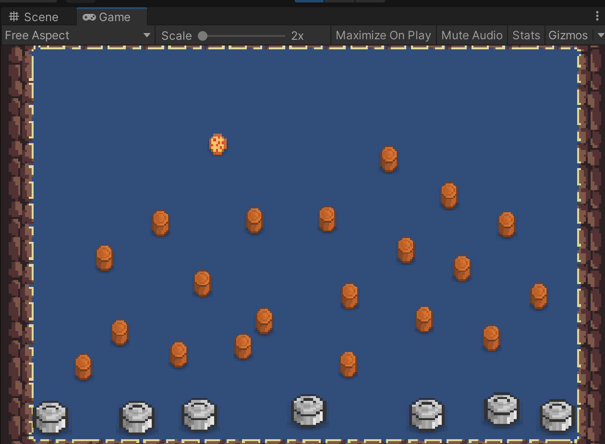

# Overview

Unity breaks its training regiment into pathways. 
The way Unity does this is by offering 2 pathways - *Unity Essentials* and *Junior Programmer*.
*Unity Essentials* is a 2 week course that targets beginners like myself.
The objective of that pathway is to learn the major areas of the Unity by creating simple games.
Along the way you learn scripting, creating 2D and 3D worlds and how to apply audio to your Unity project.

This blog covers the Unity Essentials Pathway. It is broken down into 3 Missions and is primarily focused for new users to Unity:

1. [x] **Foundations: Get Started with Unity** - Learn the basic controls and vocabulary while publishing a forked version of a ready-made game. 
2. [ ] **Foundations: Explore Unity** - Learn the basics of 2D and 3D realtime scene generation, scripting objects, and adding audio.
3. [ ] **Foundations: Learn Unity** - A mission focused on how to pursue the next steps of the learning process in the Unity journey.
    
## Missions

### Foundations: Get Started with Unity

This mission focused more on the user primarily getting used to some elementary concepts 
and vocabulary, than the user mastering a particular area and creating something truly unique.

I found this mission to be a gentle introduction into the Unity ecosystem. 
Upon completion of the mission, I installed Unity, created an FPS game from a template, 
and made slight modifications to it before publishing to the Unity Play ecosystem. 

What I found most interesting about the process was how focused the learning was 
and how well paced it was. For someone who has very uncertain footing in the 3D and 2D
world development and overall game development space, I was able to understand 3D
scene generation and the roll of assets. 
It also piqued my curiosity about the role of scripting.

One interesting aspect of the training was that it was very heavy in motivational videos 
from current Unity users. I found it to be a very empathic approach to the learner. 
Overall I found this mission to be the exact amount of complexity I needed to feel 
encouraged and challenged to continue.

**Unity IDE:**


**In Game mode:**


### Foundations: Explore Unity

#### 3D

This unit was particularly interesting. 
In this unit you program a game called "The Floor is Lava".
Just like the children's game, where you lose if you touch the lava.

It involved creating a scene from scratch with the objective of building a 
scene where the ball will hit some portions of the scene before hitting the lava.
During this process physics is added to the ball to enable bouncing and various skins were added
to different objects to change the albedo of the 3D objects. 

I manipulated Rotation and Position on all objects to see how the 
bounciness of the ball plays off the other objects in the scene. the idea is to build a complex course
in a [Rube Goldberg-esque](https://en.wikipedia.org/wiki/Rube_Goldberg_machine) manner.




#### Scripting

In this module I built upon the previous project, "TheFloorIsLava".
The major distinction is that I performed all changes within C# scripts
bound to specific objects. 

```csharp
using System.Collections;
using System.Collections.Generic;
using UnityEngine;

public class HelloWorld : MonoBehaviour
{
    // Start is called before the first frame update
    void Start()
    {

    }

    // Update is called once per frame
    void Update()
    {

    }
}
```

It was great to learn how to use the logger, 
and change position, rotation, and scale of objects 
with only 2 lines of code changes for each action.
It was as simple as (1) instantiation of public variable, 
(2) then update the object property on each new frame.

Enlarge ball on each frame:

```csharp
using System.Collections;
using System.Collections.Generic;
using UnityEngine;

public class BallTransform : MonoBehaviour
{
    public Vector3 scaleChange;
    // Start is called before the first frame update
    void Start()
    {
        
    }

    // Update is called once per frame
    void Update()
    {
        transform.localScale += scaleChange;
    }
}
```

Move top plane on each frame:

```csharp
using System.Collections;
using System.Collections.Generic;
using UnityEngine;

public class PlanePositionChange : MonoBehaviour
{
    public Vector3 positionChange;
    // Start is called before the first frame update
    void Start()
    {
        
    }

    // Update is called once per frame
    void Update()
    {
        transform.position += positionChange;
    }
}
```

Rotate bottom plane by changing its angle on each frame:

```csharp
using System.Collections;
using System.Collections.Generic;
using UnityEngine;

public class BottomPlaneRotationChange : MonoBehaviour
{
    public Vector3 rotateChange;
    // Start is called before the first frame update
    void Start()
    {
        
    }

    // Update is called once per frame
    void Update()
    {
        transform.Rotate(rotateChange);
    }
}
```

Comparing the image below with the image from the previous section,
and you can notice that the ball's size and position have changed.
Additionally, the platforms have changed their angles and positions.
The change to the scale of the ball is a little more subtle, 
but it has enlarged.




#### Audio

This module was quite a bit of fun. In it I learned about the concept of 3D audio
vs. essentially background audio. The concept is simple 3D audio changes intensity relative to 
the position of the object. You can configure this according to this panel:



These configurations were attached to the pink zombie outside the house. 
Inside the house I added ambient music that is not 3D and a 
3D audio-enabled boiling pot on the stove. 
The pink zombie also moves using C# scripting so essentially
with the envelope of 3D audio enabled with a logarithmic fade from 
0.5 to 2 we hear the doppler effect. The script was a simple one that borrowed
from the previous lesson where I update an object's position every frame:

```csharp
using System.Collections;
using System.Collections.Generic;
using UnityEngine;

public class MovingAudio : MonoBehaviour
{
    public Vector3 positionChange;
    public Vector3 rotationChange;
    // Start is called before the first frame update
    void Start()
    {
        
    }

    // Update is called once per frame
    void Update()
    {
        transform.position += positionChange;
    }
}
```

Pretty simple, yet rewarding exercise.

#### 2D

This lesson was especially fun. I learned how to create a simple Pachinko game.
Most of the prior lessons were all applicable. Even within a 2D world
the Z axis is still pertinent. It helps to determine the layering of 
2D assets in the world.

Here is a screenshot of my Pizza Pachinko project in action:



Can you guess which garbage can the pizza will end up in?

### Foundations: Learn Unity

This lesson was mostly about how to create a sustainable
learning plan and how to scope and break down work so that 
you maintain momentum and do not get discouraged.

Despite doing this in my day-to-day, it is nice being reminded 
that even in a hobbyist mentality it is good to maintain focus
and do not get discouraged, and at all times embrace the tiny wins

# Closing Thoughts

I found this pathway fundamental in establishing a structured
level of comfortability and familiarity with Unity. I now 
know the how and what of what I want to do next. 

