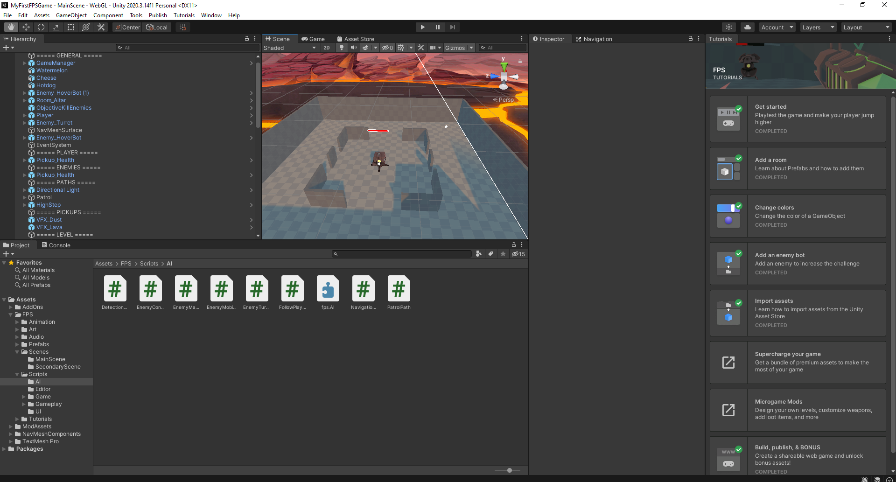
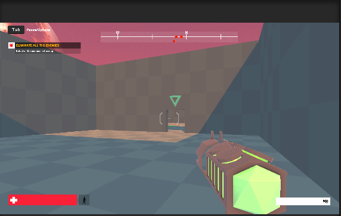

# Overview

Unity breaks its training regiment into pathways. Currently there are 2 pathways - *Unity Essentials* and *Junior Programmer*.

This blog covers the Unity Essentials Pathway. It is broken down into 3 Missions and is primarily focused for new users to Unity:

1. [x] Foundations: Get Started with Unity
2. [ ] Foundations: Explore Unity
3. [ ] Foundations: Learn Unity

    
## Missions

### Foundations: Get Started with Unity

This mission focuses on the user primarily getting used to some elementary concepts and vocabulary, moreso than the user mastering a particular area and creating something truly unique.

I found this a gentle introduction and during the process I installed Unity, created a FPS game from a template and made slight modifications to it before publishing it to the Unity Play ecosystem so that others may play. 

What I found most interesting during this process was how focused the learning was and how well paced it was. For someone who has a very uncertain footing in the VR/AR and game development space, I was able to understand it through just completing the various steps in the mission.

It was very heavy in motivational videos from current Unity users. I found it to be a very empathic approach to the learner. Overall I found this mission to be the exact amount of complexity I needed to feel encouraged and challenged to continue.

**Unity IDE:**

**In Game mode:**

### Foundations: Explore Unity

*In Progress*

### Foundations: Learn Unity

*In Progress*