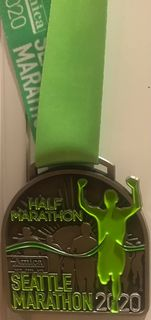
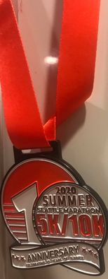

 Work

I am currently a Senior Software Engineer at **Microsoft** working on an *Azure IoT SaaS solution* for brick-and-mortar stores. Before that I worked as a data engineer for various product teams within Microsoft's Augmented Reality flagship product - the Hololens.

Prior to Microsoft, I worked at **Capital One** as a data engineer where I helped automate data science workflows in *AWS* using *Spark, Python, R, Airflow, Ansible*, and various other analytical tools. I won the Chairman and President's award within my first year of being hired based on the impact I had on the Data Science community within Capital One. This is awarded to less than 1% of the engineers each year.

Before Capital One, I worked at **AT&T** as a big data engineer. It was here that I learned to become proficient with *Hive, Pig,* and the *Hadoop* ecosystem in general. 

It was just prior to this where my career started as an algorithms and software engineer for **Raytheon's Intelligence, Information, and Services (IIS)** division. It was there I obtained a *top secret clearance*, learned about *natural language processing (NLP)*, and *swarm intelligence* paradigms.

 Education

I am currently pursuing an MS in CS at the **University of Washington** with a 3.82 GPA, and am expected to graduate end of year 2022.

***Courses Taken:***

<!--
- [Enterprise Chatbots](https://www.charlesdrotar.com/posts/uw/EnterpriseChatbots.html/)
- [Natural Language Processing](https://www.charlesdrotar.com/posts/uw/NaturalLanguageProcessing.html/)
- [Machine Learning](https://www.charlesdrotar.com/posts/uw/MachineLearning.html/)
- [Game Theory](https://www.charlesdrotar.com/posts/uw/GameTheory.html/)
- [Computational Biology](https://www.charlesdrotar.com/posts/uw/ComputationalBiology.html/)
- [Colloquia](https://www.charlesdrotar.com/posts/uw/Colloquia.html/)
-->

- Enterprise Chatbots
- Natural Language Processing
- Machine Learning
- Game Theory
- Computational Biology

***Course (In Progress):***
- Security Engineering

I Also have a BS in EE from the **University of North Texas**.

## Personal History

Issaquah, Washington is home. 
My work and studies have taken me from the Dallas Fort-Worth Metroplex 
to the state of Washington. My travels have taken me to Kosovo, Albania, 
Turkey, Japan, Australia, and the Dominican Republic.

Since coming to Washington I have started training for half marathons. 
I have completed one half-marathon so far and will start 2022
with a goal of 2 half marathons a year.

I intend to do the Seattle Half Marathon on November 28, 2021.

| Race      | Distance   | Date | Medal |
| ----------- | ----------- | ----------- |----------- |
| *(2021 Amica Insurance Seattle Marathon)*   | *(Half Marathon)*        | *(November 28th 2021)*       |         |
| 2020 Amica Insurance Seattle Marathon      | Half Marathon       | November 29th 2020       |        |
| 2020 Seattle Marathon Summer 5K/10K    | 10k        | August 22nd 2020       |        |

